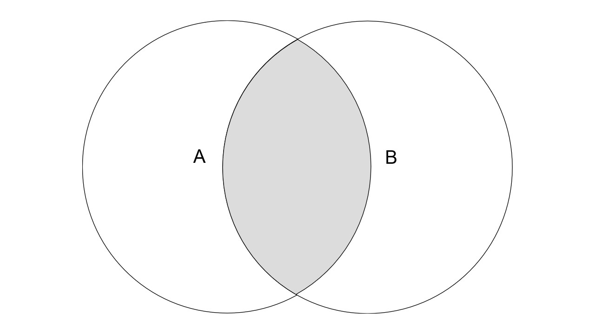
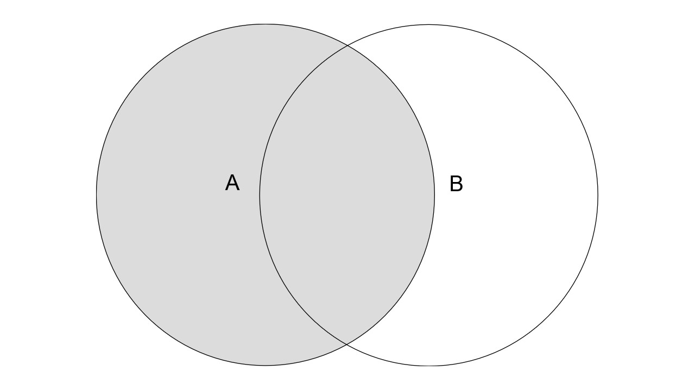
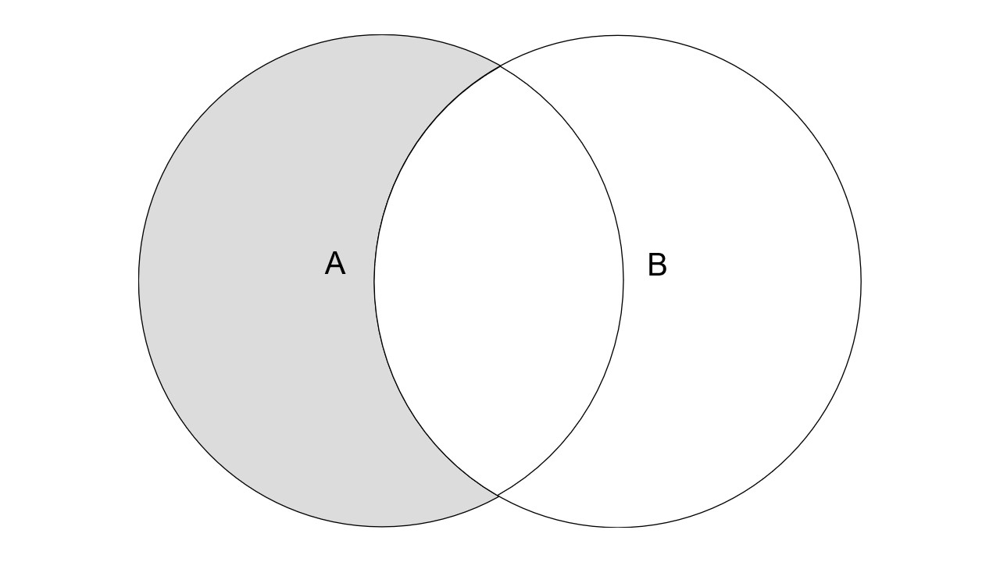
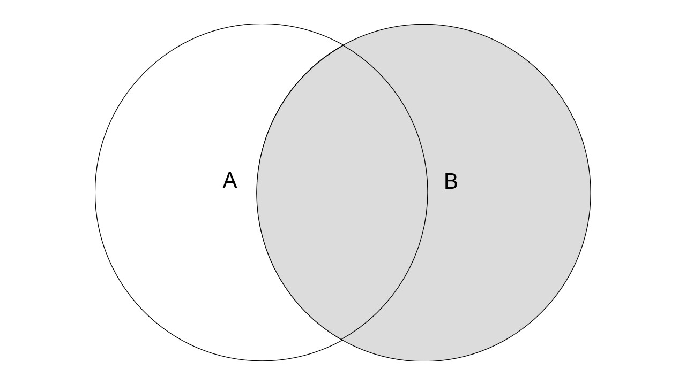
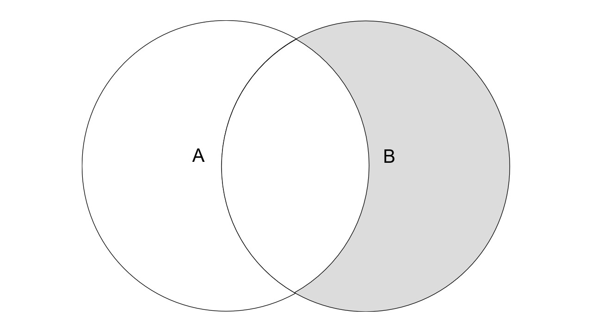
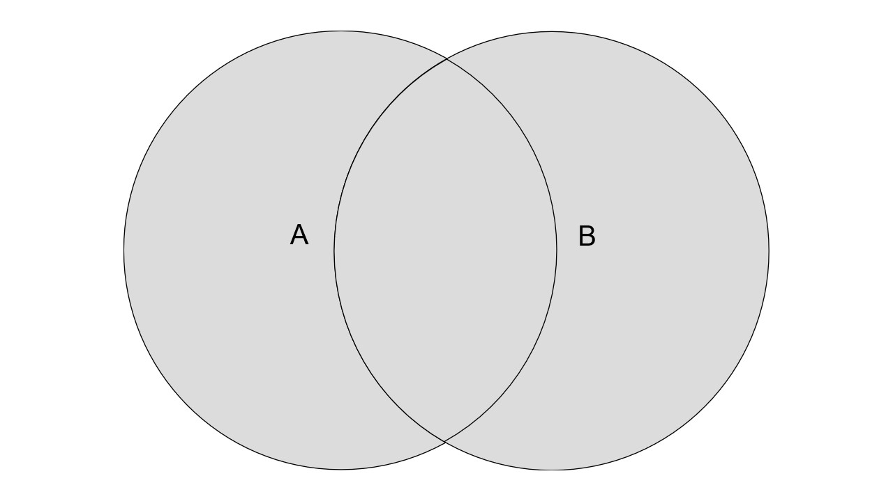
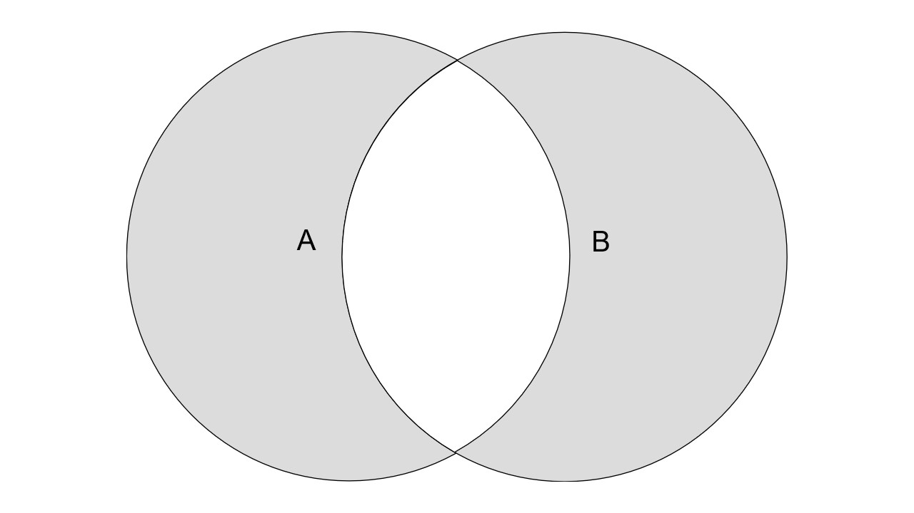

# SQL表连接
## 种类
* INNER
* LEFT OUTER
* RIGHT OUTER
* FULL OUTER
* CROSS

## 图文解释
### (INNER) JOIN (INNER可省略)
```java
SELECT <select_list>
FROM table A
INNER JOIN table B
ON A.key = B.key
```


### LEFT (OUTER) JOIN (OUTER可省略)
```java
SELECT <select_list>
FROM table A
LEFT JOIN table B
ON A.key = B.key
```

```java
SELECT <select_list>
FROM table A
LEFT JOIN table B
ON A.key = B.key
WHERE B.key IS NULL
```


### RIGHT (OUTER) JOIN (OUTER可省略)
```java
SELECT <select_list>
FROM table A
RIGHT JOIN table B
ON A.key = B.key
```

```java
SELECT <select_list>
FROM table A
RIGHT JOIN table B
ON A.key = B.key
WHERE A.key IS NULL
```


### FULL OUTER JOIN
```java
SELECT <select_list>
FROM table A 
FULL OUTER JOIN table B
ON A.key = B.key
```

```java
SELECT <select_list>
FROM table A
FULL OUTER JOIN table B
ON A.key = B.key
WHERE A.key IS NULL
OR B.key IS NULL
```


### CROSS JOIN (`不支持ON语法`)
返回两张表的`笛卡尔积`，也就是不指定结合规则，让两表中的元素直接两两结合。
```java
SELECT <select_list>
FROM table A
CROSS JOIN table B
```