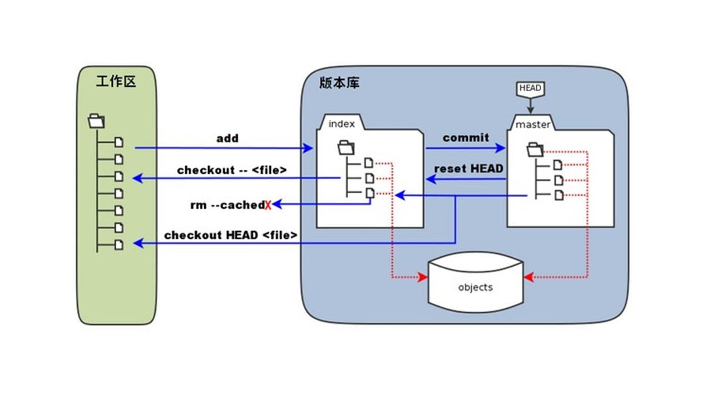

# Git工作流
## 示意图

     
`说明`：
* workspace：工作区
* staging area：暂存区/缓存区
* local repository：版本库/本地仓库
* remote repository：远程仓库  

## Git操作总结
* 工作流 → 工作区 → 暂存区 → 版本库 →
* 初始化 ： `git init` → `git add` → `git commit` →
* 远程仓库 ： `git remote add` → `git pull` → `git push` → `git clone`  
* 分支管理 ： `git branch` → `git checkout` → `git merge` 
* 标签管理 ： `git tag` → `git push`
