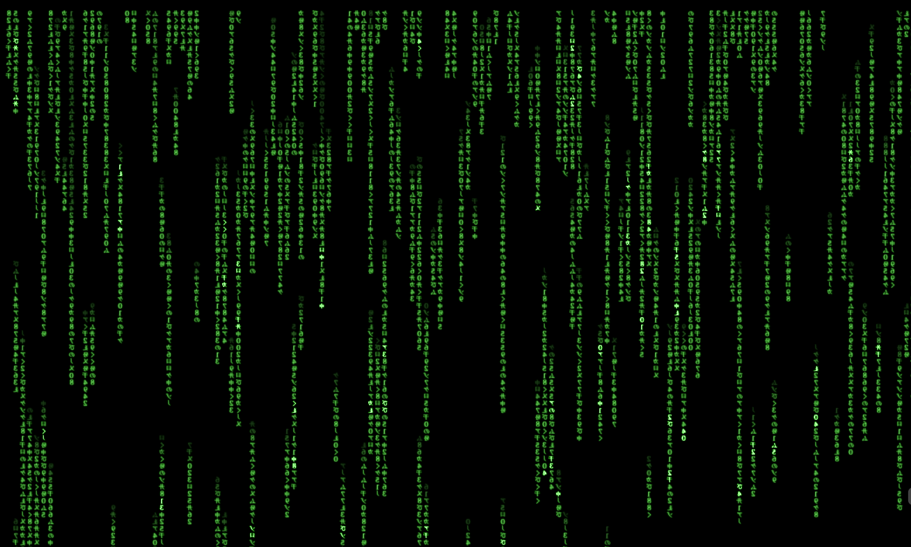

# The Matrix黑客帝国屏保
## 来源
[代码来源](https://blog.csdn.net/huan_chen/article/details/52692777)
[操作步骤来源](https://zhuanlan.zhihu.com/p/97608960)
## 效果图：

## 操作步骤：
1. 打开VS2013或以上版本，新建—>项目,Visual C++，win32，选择win32控制台应用程序，名称填写为"hacker"。

2. 将以下代码复制到项目源文件中

3. 编译项目工程

4. 找到生成的exe文件，将exe后缀改为scr（hacker.exe->hacker.scr）

5. 将文件hacker.scr拷贝到C:\Windows\System32下

6. 鼠标移到桌面，右击，选择个性化，屏幕保护程序，选择hacker。

属于自己的黑客帝国屏幕保护程序就设置成功啦！

```c++
#include "stdio.h"  
#include <windows.h>  
  
#define ID_TIMER    1   
#define STRMAXLEN  25 //一个显示列的最大长度   
#define STRMINLEN  8  //一个显示列的最小长度  
  
LRESULT CALLBACK WndProc (HWND, UINT, WPARAM, LPARAM) ;   
//   
//   
typedef struct tagCharChain //整个当作屏幕的一个显示列,这是个双向列表   
{   
    struct tagCharChain *prev; //链表的前个元素   
    TCHAR  ch;                  //一个显示列中的一个字符   
    struct tagCharChain *next; //链表的后个元素   
}CharChain, *pCharChain;  
  
typedef struct tagCharColumn   
{   
    CharChain *head, *current, *point;   
    int x, y, iStrLen; //显示列的开始显示的x,y坐标,iStrLen是这个列的长度   
    int iStopTimes, iMustStopTimes; //已经停滞的次数和必须停滞的次数,必须停滞的次数是随机的   
}CharColumn, *pCharColumn;  
  
int main(HINSTANCE hInstance, HINSTANCE hPrevInstance,   
    PSTR szCmdLine, int iCmdShow)   
{   
    static TCHAR szAppName[] = TEXT ("matrix") ;   
    HWND            hwnd ;   
    MSG            msg ;   
    WNDCLASS    wndclass ;  
  
    wndclass.style                = CS_HREDRAW | CS_VREDRAW ;   
    wndclass.lpfnWndProc        = WndProc ;   
    wndclass.cbClsExtra        = 0 ;   
    wndclass.cbWndExtra        = 0 ;   
    wndclass.hInstance        = hInstance ;  
  
    wndclass.hIcon                = LoadIcon (NULL, IDI_APPLICATION) ;   
    wndclass.hCursor        = LoadCursor (NULL, IDC_ARROW) ;   
    wndclass.hbrBackground        = (HBRUSH) GetStockObject (BLACK_BRUSH) ;   
    wndclass.lpszMenuName        = NULL ;   
    wndclass.lpszClassName        = szAppName ;  
  
    if(!RegisterClass (&wndclass))   
    {   
        MessageBox (NULL, TEXT ("此程序必须运行在NT下!"), szAppName, MB_ICONERROR) ;   
        return 0;   
    }  
  
    hwnd = CreateWindow (szAppName, NULL,   
        WS_DLGFRAME | WS_THICKFRAME | WS_POPUP,   
        0, 0,   
        GetSystemMetrics(SM_CXSCREEN), GetSystemMetrics(SM_CYSCREEN),   
        NULL, NULL, hInstance,   
        NULL) ;  
  
    ShowWindow (hwnd, SW_SHOWMAXIMIZED) ; //最大化显示   
    UpdateWindow (hwnd) ;   
    ShowCursor(FALSE); //隐藏鼠标光标   
  
    srand ((int) GetCurrentTime ()) ; //初始化随机数发生器   
    while (GetMessage (&msg, NULL, 0, 0))   
    {   
        TranslateMessage (&msg) ;   
        DispatchMessage (&msg) ;   
    }   
    ShowCursor(TRUE); //显示鼠标光标   
    return msg.wParam ;   
}  
  
TCHAR randomChar() //随机字符产生函数   
{   
    return (TCHAR)(rand()%2+0x30); //33到126之间   
}  
  
int init(CharColumn *cc, int cyScreen, int x) //初始化   
{   
    int j;   
    cc->iStrLen = rand()%(STRMAXLEN-STRMINLEN) + STRMINLEN; //显示列的长度   
    cc->x = x+3 ;        //显示列的开始显示的x坐标   
    cc->y =rand()%3?rand()%cyScreen:0; //显示列的开始显示的y坐标   
    cc->iMustStopTimes = rand()%6 ;   
    cc->iStopTimes    = 0 ;   
    cc->head = cc->current =   
        (pCharChain)calloc(cc->iStrLen, sizeof(CharChain)); //生成显示列   
    for(j=0; j<cc->iStrLen-1; j++)   
    {   
        cc->current->prev = cc->point; //cc->point一个显示列的前个元素   
        cc->current->ch  = '\0';   
        cc->current->next = cc->current+1; //cc->current+1一个显示列的后个元素   
        cc->point          = cc->current++; //cc->point = cc->current; cc->current++;   
    }   
    cc->current->prev = cc->point; //最后一个节点   
    cc->current->ch  = '\0';   
    cc->current->next = cc->head;   
    cc->head->prev    = cc->current; //头节点的前一个为此链的最后一个元素  
  
    cc->current = cc->point = cc->head; //free掉申请的内存要用current当参数   
    cc->head->ch = randomChar(); // 对链表头的 元素填充   
    return 0;   
}  
  
LRESULT CALLBACK WndProc (HWND hwnd, UINT message, WPARAM wParam, LPARAM lParam)   
{   
    HDC          hdc ;   
    //ctn 用来确定一个显示链是否 向下前进,如果等待次数超过必须等待的次数,ctn就代表要向下前进   
    int i, j, temp, ctn; //j为一个显示链中除链表头外的在屏幕上显示的y坐标,temp绿色过度到黑色之用   
    static  HDC hdcMem;   
    HFONT    hFont;   
    static  HBITMAP hBitmap;   
    static  int cxScreen, cyScreen; //屏幕的宽度 高度.   
    static  int iFontWidth=10, iFontHeight=15, iColumnCount; //字体的宽度 高度, 列数   
    static  CharColumn *ccChain;  
  
    switch (message)   
    {   
    case WM_CREATE:   
        cxScreen = GetSystemMetrics(SM_CXSCREEN) ; //屏幕宽度   
        cyScreen = GetSystemMetrics(SM_CYSCREEN) ;   
        SetTimer (hwnd, ID_TIMER, 10, NULL) ;  
  
        hdc = GetDC(hwnd);   
        hdcMem = CreateCompatibleDC(hdc);   
        hBitmap = CreateCompatibleBitmap(hdc, cxScreen, cyScreen);   
        SelectObject(hdcMem, hBitmap);   
        ReleaseDC(hwnd, hdc);   
        //创建字体   
        hFont = CreateFont(iFontHeight, iFontWidth-5, 0, 0, FW_BOLD, 0, 0, 0,   
            DEFAULT_CHARSET, OUT_DEFAULT_PRECIS, CLIP_DEFAULT_PRECIS,   
            DRAFT_QUALITY, FIXED_PITCH | FF_SWISS, TEXT("Fixedsys"));   
        SelectObject(hdcMem, hFont);   
        DeleteObject (hFont) ;   
        SetBkMode(hdcMem, TRANSPARENT); //设置背景模式为 透明   
        iColumnCount = cxScreen/(iFontWidth*3/2); //屏幕所显示字母雨的列数  
  
        ccChain = (pCharColumn)calloc(iColumnCount, sizeof(CharColumn));   
        for(i=0; i<iColumnCount; i++)   
        {   
            init(ccChain+i, cyScreen, (iFontWidth*3/2)*i);   
        }   
        return 0 ;  
  
    case WM_TIMER:   
        hdc = GetDC(hwnd);   
        PatBlt (hdcMem, 0, 0, cxScreen, cyScreen, BLACKNESS) ; //将内存设备映像刷成黑色   
        for(i=0; i<iColumnCount; i++)   
        {   
            ctn = (ccChain+i)->iStopTimes++ > (ccChain+i)->iMustStopTimes;   
            //   
            (ccChain+i)->point = (ccChain+i)->head; //point用于遍历整个显示列   
  
            //第一个字符显示为 白色   
            SetTextColor(hdcMem, RGB(255, 255, 255));   
            TextOut(hdcMem, (ccChain+i)->x, (ccChain+i)->y, &((ccChain+i)->point->ch), 1);   
            j = (ccChain+i)->y;    
            (ccChain+i)->point = (ccChain+i)->point->next;   
            //遍历整个显示列,将这个显示列里的字符从下往上显示   
            temp = 0 ; //temp绿色过度到黑色之用   
            while((ccChain+i)->point != (ccChain+i)->head && (ccChain+i)->point->ch)   
            {   
                SetTextColor(hdcMem, RGB(0, 255-(255*(temp++)/(ccChain+i)->iStrLen), 0));   
                TextOut(hdcMem, (ccChain+i)->x, j-=iFontHeight, &((ccChain+i)->point->ch), 1);   
                (ccChain+i)->point = (ccChain+i)->point->next;   
            }   
            if(ctn)   
                (ccChain+i)->iStopTimes = 0 ;   
            else continue;   
            (ccChain+i)->y += iFontHeight; //下次开始显示的y坐标 为当前的y坐标加上 一个字符的高度   
            //如果开始显示的y坐标减去 整个显示列的长度超过了屏幕的高度   
            if( (ccChain+i)->y-(ccChain+i)->iStrLen*iFontHeight > cyScreen)   
            {   
                free( (ccChain+i)->current );   
                init(ccChain+i, cyScreen, (iFontWidth*3/2)*i);   
            }   
            //链表的头 为此链表的前个元素,因为下次开始显示的时候 就相当与在整个显示列的开头添加个元素,然后在开始往上显示   
            (ccChain+i)->head = (ccChain+i)->head->prev;   
            (ccChain+i)->head->ch = randomChar();   
        }   
  
        BitBlt(hdc, 0, 0, cxScreen, cyScreen, hdcMem, 0, 0, SRCCOPY);   
        ReleaseDC(hwnd, hdc);   
        return 0;  
  
    case WM_RBUTTONDOWN:   
        KillTimer (hwnd, ID_TIMER) ;   
        return 0;  
  
    case WM_RBUTTONUP:   
        SetTimer (hwnd, ID_TIMER, 10, NULL) ;   
        return 0;  
  
        //处理善后工作   
    case WM_KEYDOWN:   
    case WM_LBUTTONDOWN:   
    case WM_DESTROY:   
        KillTimer (hwnd, ID_TIMER) ;   
        DeleteObject(hBitmap);   
        DeleteDC(hdcMem);   
        for(i=0; i<iColumnCount; i++)   
        {   
            free( (ccChain+i)->current );   
        }   
        free(ccChain);   
        PostQuitMessage (0) ;   
        return 0 ;   
    }   
    return DefWindowProc (hwnd, message, wParam, lParam) ;   
}  
```

## 参考
[12个好玩的屏保](https://zhuanlan.zhihu.com/p/214215174)    
[文件下载](https://www.screensaversplanet.com/screensavers/the-matrix-563/)
