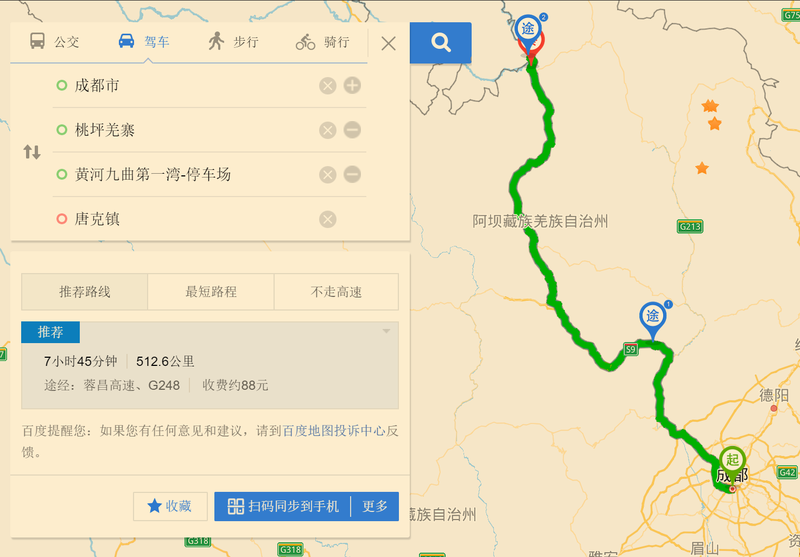
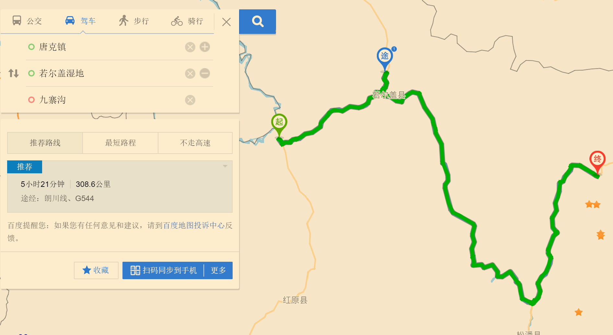
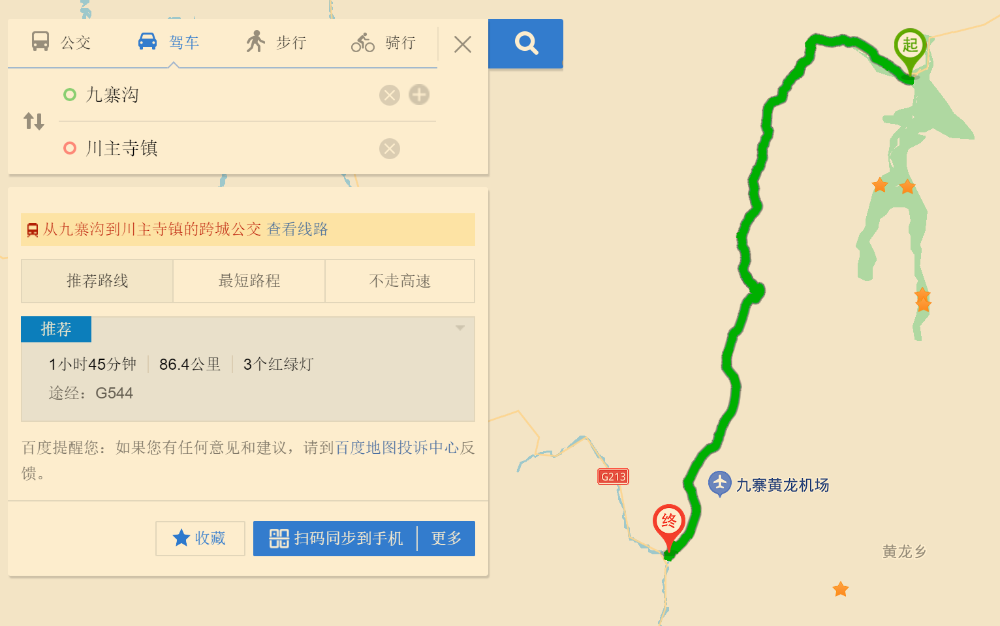
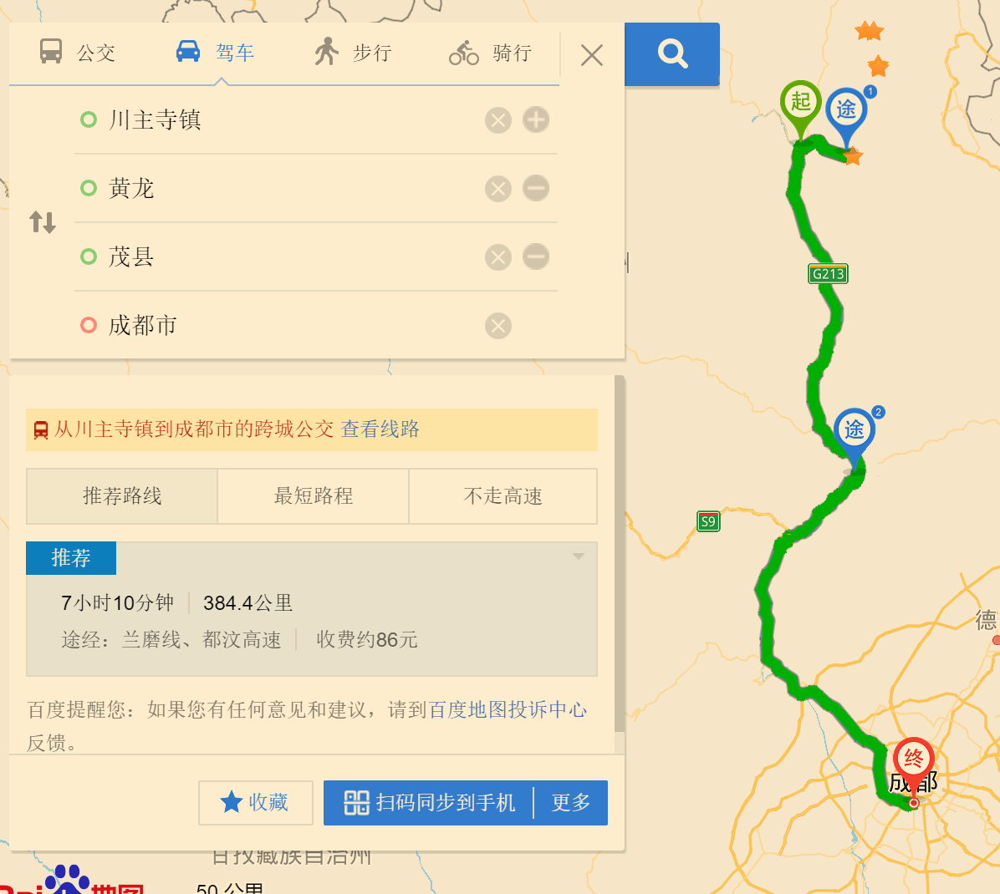

# 景点
## 地点
### 四川九寨沟
#### 概况
`九寨沟`:[官网](https://www.jiuzhai.com/)   
`地图`:[九寨沟、黄龙交通地图](http://www.6cts.com/jzg/jzgznf.html)     
`票价信息`:[门票、观光票](https://www.jiuzhai.com/intelligent-service/tickets)         
`交通方式`:[成都出发G213九环西线](https://www.jiuzhai.com/intelligent-service/arrival-mode)        
`游玩路线`:[东线/西线/草原线](https://www.jiuzhai.com/intelligent-service/self-help-route)      
`游玩方式`:[1-3日游玩安排](https://www.jiuzhai.com/intelligent-service/way-of-play)      

#### 旅行地图
* 第一天旅行图
  
* 第二天旅行图
  
* 第三天旅行图
  
* 第四天旅行图
  

#### 行程安排
##### 第一日
`出发`:成都→桃坪羌寨→九曲黄河第一湾→唐克   
```

```    
`住宿`:[唐克]()     

##### 第二日
`出发`:[唐克→若尔盖花湖湿地公园→九寨沟]()         
`住宿`:[九寨沟布嘉民宿](https://hotels.ctrip.com/hotels/detailPage?allianceid=4897&sid=758451&ouid=000401app-&hotelId=901865&checkin=2021/08/28&checkout=2021/08/29)

##### 第三日
`出发`:[九寨沟一日游→川主寺]()           
`住宿`:[川主寺]()

##### 第四日
`出发`:[川主寺→黄龙景区→茂县→成都]
```javascript
https://map.baidu.com/dir/%E5%B7%9D%E4%B8%BB%E5%AF%BA%E9%95%87/%E9%BB%84%E9%BE%99%E9%A3%8E%E6%99%AF%E5%8C%BA/%E8%8C%82%E5%8E%BF/%E6%88%90%E9%83%BD%E5%B8%82/@11643584.533610417,3701360.912361568,8.49z?querytype=nav&c=32&sn=1$$5ffb18164bd9965e6f4760f7$$11536037.79,3843289.21$$%E5%B7%9D%E4%B8%BB%E5%AF%BA%E9%95%87$$0$$$$&en=2$$$$$$%E9%BB%84%E9%BE%99$$0$$$$$$1$$%20to:2$$$$$$%E8%8C%82%E5%8E%BF$$0$$$$$$1$$%20to:2$$$$$$%E6%88%90%E9%83%BD$$0$$$$&sc=32&ec=32+to:32+to:32&pn=0&rn=5&mrs=0&version=4&route_traffic=1&sy=0&da_src=shareurl
```

#### 参考
[成都到九寨沟路线示意图](http://www.qujiuzhai.com/122.html)             
[栗子:游玩攻略](https://www.xiaohongshu.com/discovery/item/60b4a1740000000021036460?xhsshare=WeixinSession&appuid=5d4c4771000000001603969a&apptime=1629986821)               