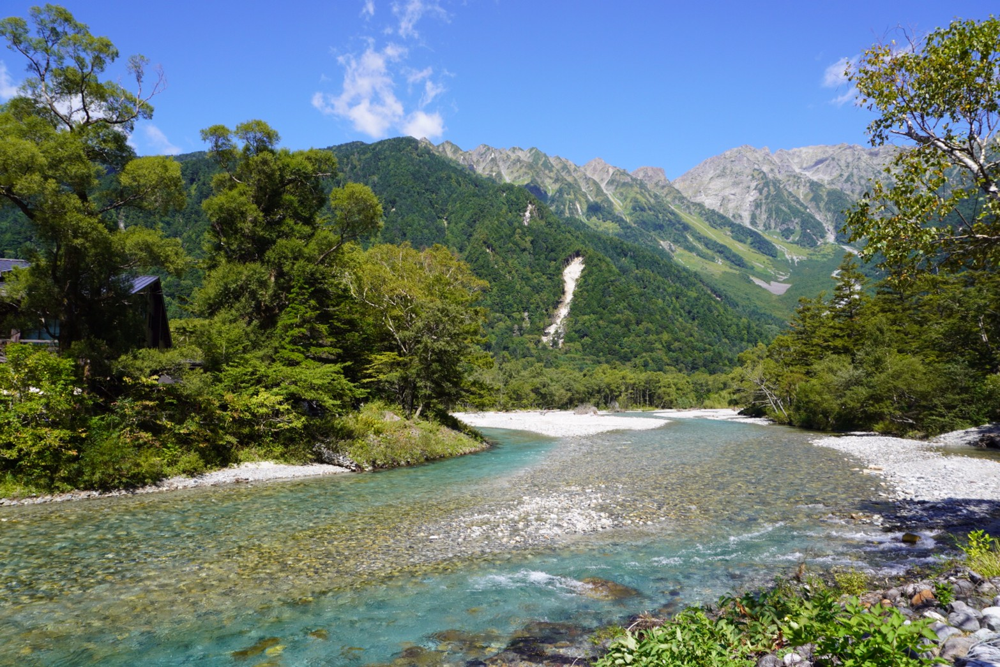
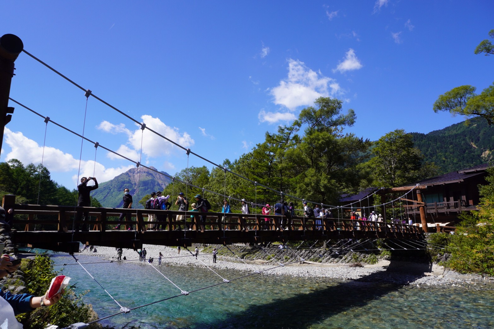
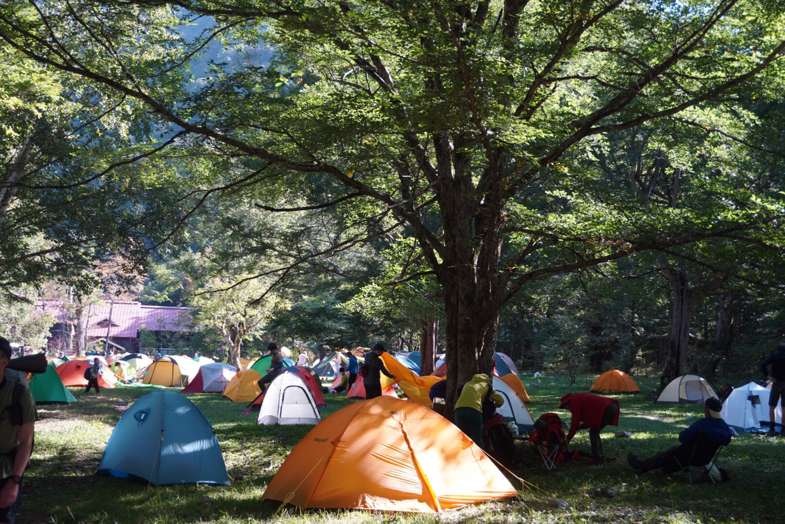
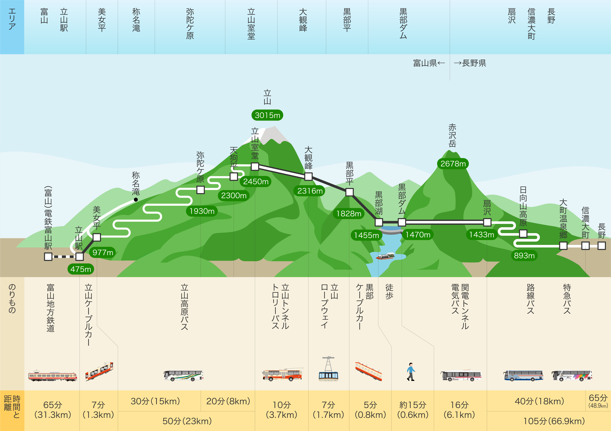

# 景点
## 工具
### 地图
#### 日本地图   
   
#### 东京JR   
   
#### 东京地图   
   
#### 参考信息
`日本地图查询`:[都道府県を日本地図から選ぶ](https://uub.jp/map/)      
`东京地图查询`:[東京都 都道府県から地図を検索](https://www.mapion.co.jp/map/admi13.html)    
`东京JR查询`:[路線図](https://www.jreast.co.jp/map/)    

## 東京都
### 立川市
#### 国营昭和纪念公园
##### 公园相关信息      
`地址`：〒190-0014 東京都立川市緑町３１７３     
`交通方式`：[6个入口]((https://www.showakinen-koen.jp/access/))     
`开园时间`：[年末年始以外](https://www.showakinen-koen.jp/guide/schedule/)      
`设施介绍`：[参照园内地图](https://www.showakinen-koen.jp/facility/)（[中文介绍](https://www.showakinen-koen.jp/zh/)）     
`门票费用`：[450JPY](https://www.showakinen-koen.jp/guide/price/)     
`最近更新`：[10月3日更新](https://www.showakinen-koen.jp/information/craft-event/)      
`注意事项`：[禁止携带](https://www.showakinen-koen.jp/guide/forbidden/)部分物品      

##### 参考信息
`完全攻略`：[完全ガイド](https://haveagood.holiday/articles/197)    
`季节介绍`：[季節ごとに紹介](https://aumo.jp/articles/46171)  
`1日计划`：[1日遊ぶプラン](https://play-life.jp/plans/18578)         
`向日葵照片`：[ひまわりの写真](https://www.himawaribatake.net/showakinenpark.php)      

### 八王子市
#### 高尾山
`地址`： 〒193-0844 东京都八王子市高尾町         
`网址主页`：[高尾登山電鉄登山コース](https://www.takaotozan.co.jp/course/)     
`交通方式`:[`出発地`→`高尾`→`高尾さん口`](https://www.takaotozan.co.jp/trafic/)　　
```
目的駅は高尾駅ではなく、高尾山口である。要注意！
```
#### 参考消息 　　　
`攻略`:[高尾山の初心者おすすめコース！登山にご利益、グルメを満喫](https://travel.rakuten.co.jp/mytrip/howto/takaosan-guide)                
[登山コース](https://mttakaomagazine.com/trails)   
[世界に誇る高尾山は絶景、ビール、温泉と楽しさ満載の楽園だった！](https://gurutabi.gnavi.co.jp/a/a_2063/)     
[【高尾山】世界上登山客最多的山？选一条线路，找几位朋友，相约高尾山～](https://matcha-jp.com/cn/1329)                       

### あきる野市
#### 秋川溪谷
##### 溪谷相关信息
`地址`：〒190-0173 東京都あきる野市戸倉７１８    
`网址主页`：[秋川渓谷](https://www.akirunokanko.com/)    
`交通方式`:[アクセス・散策マップ](https://www.akirunokanko.com/?cat=41)
`瀬音の湯`:[网址主页](http://www.seotonoyu.jp/)

##### 附近景点美食
`小屋别墅`:[秋川渓谷リバーティオ](https://www.rivertio.com/about/)     
`お蕎麦`:[寿庵忠左衛門](http://www.sumiya-men.com/?mode=f2)　　　　
`温泉别墅`:[宿泊コテージ](http://www.seotonoyu.jp/cottage/cottage-price/)    
`周围景点`:[秋川渓谷 瀬音の湯 周辺観光情報](http://www.seotonoyu.jp/sightseeing/)   

##### 参考信息
`攻略`:[秋川渓谷（あきがわけいこく）の魅力](http://www.city.akiruno.tokyo.jp/0000001850.html)    
`じゃらんnet评价`:[秋川渓谷](https://www.jalan.net/kankou/spt_13228ab2040116440/)

### 青梅市
#### 御岳山
##### 御岳山相关信息
`地址`： 〒198-0001 東京都青梅市御岳山  (みたけさん)      
`网址主页`：[青梅市御岳観光ガイド](https://www.ome-okutama.com/mitake/)     
`交通方式`:[`出発地`→`御嶽駅`](https://www.ome-okutama.com/mitake/access.html)

##### 参考消息
`青梅観光ガイド`:[御岳山を本格トレッキング+温泉コース](https://www.city.ome.tokyo.jp/site/omekanko/20258.html)   　　　
`攻略`:[【东京近郊】山林溪谷当天来回！“御岳山”赏奇岩观瀑布
](https://matcha-jp.com/cn/5469)             
[御岳山ハイキングコース](https://www.omekanko.gr.jp/course/mitake-mountain-hiking/)     


## 長野県
### 松本市
#### 松本城
`官网`:[国宝松本城](https://www.matsumoto-castle.jp/)   
`地址`:[〒390-0873 長野県松本市丸の内4番1号](https://www.matsumoto-castle.jp/access)   
`实景`:
   
#### 上高地
##### 上高地相关信息
`官网`：[上高地を知る](https://www.kamikochi.or.jp/)
`地址`：[沢渡（さわんど）駐車場](https://www.kamikochi.or.jp/access)   
`气候条件`：[着装指南](https://www.kamikochi.or.jp/learn/season)
#### 游玩实景
风景    
        
          
露营    
          
##### 参考信息
`上高地游玩攻略`：[上高地攻略](https://chubu.letsgojp.com/archives/412709/)    
`上高地露营`：[上高地キャプ](https://www.kamikochi.or.jp/enjoy/campsites)   
`上高地附近公园`：[国営アルプスあづみの公園](http://www.azumino-koen.jp/horigane_hotaka/)

## 富山県
### 立山黒部
#### 立山黑部相关信息
`官网`:[立山黒部アルペンルート](https://www.alpen-route.com/about/)          
`到达方式`:[JR方式](https://www.alpen-route.com/access_new/access/railways.html)          
`时刻表`:[各站时刻表](https://www.alpen-route.com/timetable/)                  
`票价`:[扇沢→立山駅](https://www.alpen-route.com/access_new/recommend-tickets/today.html)            
`地图`:            

#### 参考信息
`東京発・大阪発観光指南`:[朝からたっぷり1日観光立山黒部](https://travel.willer.co.jp/tour/campaign/tateyama/)            　　　
`立山黑部交通指南`:[立山黑部懒人指南](https://lazyjapan.com/regions/tateyama/transport/)                
`首都圈外旅行`:[お勧め周遊モデルコース](https://www.alpen-route.com/city/tokyo.php)           
`RETRIP`:[おいおい！こんなにあるの？東京から日帰りもＯＫ！日本一の絶景や温泉！”立山黒部アルペンルート”の日本一１８選！](https://rtrp.jp/articles/92115/)                　　
`立山黒部アルペンルート旅行記`:[【東京から日帰りも】立山黒部アルペンルートでいろんな乗り物を体験！！（夏は避暑地だ）](https://wnkhs.net/2019/08/tateyama-kurobe-alpen-route/)           
`みけねこ旅情報`:[「立山黒部アルペンルート」、「雪の大谷」を東京からの日帰りで観光する方法](https://mikeneko.site/post-1630/)            
`立山黒部旅行記`:[《東京から日帰り》#26　富山県　雪の大谷・立山黒部アルペンルート](https://4travel.jp/travelogue/11006458)              

