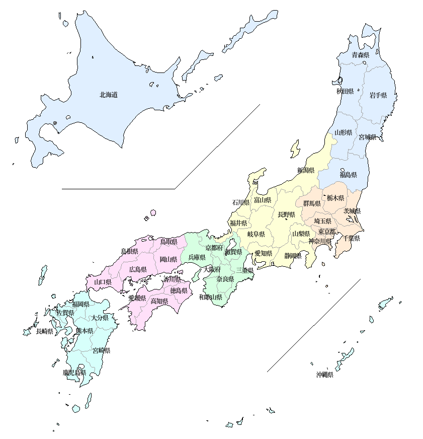
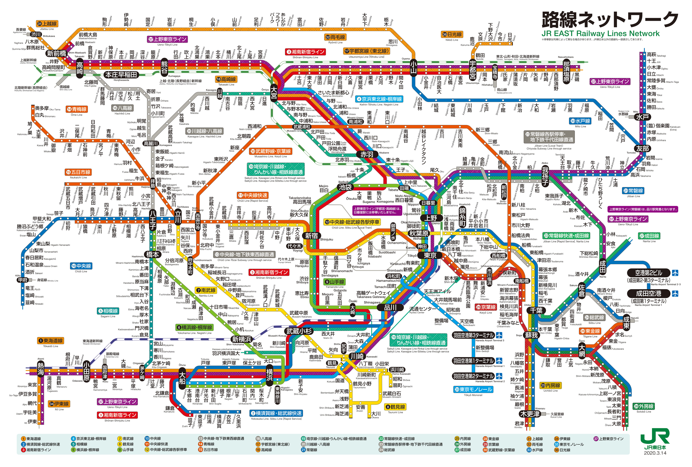
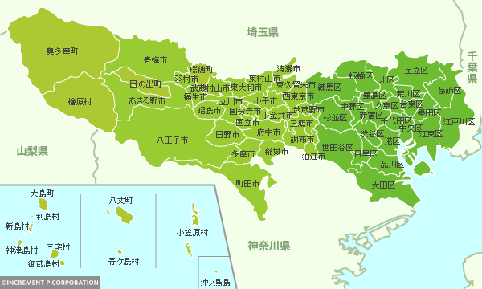

## 景点
### 地图
#### 日本地图   
   
#### 东京JR   
   
#### 东京地图   
   
#### 参考信息
`日本地图查询`:[都道府県を日本地図から選ぶ](https://uub.jp/map/)      
`东京地图查询`:[東京都 都道府県から地図を検索](https://www.mapion.co.jp/map/admi13.html)    
`东京JR查询`:[路線図](https://www.jreast.co.jp/map/)    

### 立川市
#### 国营昭和纪念公园
##### 公园相关信息      
`地址`：〒190-0014 東京都立川市緑町３１７３     
`交通方式`：[6个入口]((https://www.showakinen-koen.jp/access/))     
`开园时间`：[年末年始以外](https://www.showakinen-koen.jp/guide/schedule/)      
`设施介绍`：[参照园内地图](https://www.showakinen-koen.jp/facility/)（[中文介绍](https://www.showakinen-koen.jp/zh/)）     
`门票费用`：[450JPY](https://www.showakinen-koen.jp/guide/price/)     
`最近更新`：[10月3日更新](https://www.showakinen-koen.jp/information/craft-event/)      
`注意事项`：[禁止携带](https://www.showakinen-koen.jp/guide/forbidden/)部分物品      

##### 参考信息
`完全攻略`：[完全ガイド](https://haveagood.holiday/articles/197)    
`季节介绍`：[季節ごとに紹介](https://aumo.jp/articles/46171)  
`1日计划`：[1日遊ぶプラン](https://play-life.jp/plans/18578)         
`向日葵照片`：[ひまわりの写真](https://www.himawaribatake.net/showakinenpark.php)      

### あきる野市
#### 秋川溪谷
##### 溪谷相关信息
`地址`：〒190-0173 東京都あきる野市戸倉７１８    
`网址主页`：[秋川渓谷](https://www.akirunokanko.com/)    
`交通方式`:[アクセス・散策マップ](https://www.akirunokanko.com/?cat=41)
`瀬音の湯`:[网址主页](http://www.seotonoyu.jp/)

##### 附近景点美食
`小屋别墅`:[https://www.rivertio.com/](https://www.rivertio.com/about/)     
`お蕎麦`:[寿庵忠左衛門](http://www.sumiya-men.com/?mode=f2)

##### 参考信息
`攻略`:[秋川渓谷（あきがわけいこく）の魅力](http://www.city.akiruno.tokyo.jp/0000001850.html)    
`じゃらんnet评价`:[秋川渓谷](https://www.jalan.net/kankou/spt_13228ab2040116440/)
