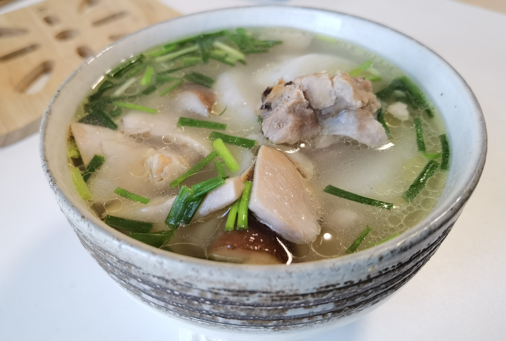

# 美食
## 餐厅
### たま館　立川
`地点`：〒190-0022 [東京都立川市錦町1丁目2-16](https://tabelog.com/tokyo/A1329/A132901/13251412/)         
`営業時間`： 11:00～15:00          
            18:00～23:00           
`相关博客介绍`：[立川でラーメンならあの名店も二郎系も勢揃いの『たま館』へ！たま館ラーメン店最新情報！](https://www.favy.jp/topics/1730)          
[附近其它店铺介绍](http://blog.livedoor.jp/zatsu_ke/archives/cat_10020063.html)        
`特色`：魚介類ラーメン、辛いラーメン
`图片`：            　　　　　　　　　　       

### 大户屋 立川店
`地点`：東京都 立川市曙町2-5-17 イノタケビル2F    
`网站`：[立川北口店](https://www.ootoya.com/store/detail/000091.html)    
`特色`：`定食`，`沙拉`，`和式套餐`    
`食物图片`：[定食套餐](https://www.ootoya.com/menu/teisyoku/)
`定食套餐`：

### 麻婆唐府 池袋店
地点：東京都豊島区西池袋1-38-3 3F        
`网站`：[麻婆唐府池袋店](https://themarbotofu-ikebukuro.owst.jp/)     
特色：中华料理，四川料理     
参考网站：[食べログ](https://tabelog.com/tokyo/A1305/A130501/13211080/)     

## 购物 
### 业务超市 昭岛店
地址：[東京都昭島市中神町1-23-20](https://www.gyomusuper.jp/shop/detail.php?sh_id=1537)           
种类：蔬菜，水果，肉类，冷冻食品，酒类  [商品介绍](https://www.gyomusuper.jp/item/index.php)      
            
营业时间：`9:00`-`21:00`              

## 自作料理
### 煲仔饭
#### 制作步骤
1. 准备材料：`腊肠`，`大米`，`西蓝花`(`小白菜`)，`鸡蛋`。     
2. 取一口砂锅，在锅底薄薄的抹一层油。      
3. 大米洗净，浸泡`一个小时`以上。然后放入砂锅，加水没过米即可。然后加入少量食盐，搅拌均匀。    
4. 将砂锅移至火上，不加盖子大火煮开立即转小火，盖上盖子焖熟。将米饭煮至8分熟。
5. 将腊肠切片（猪肉切片，加料酒酱油等调料腌制半小时），再切点姜丝。   
6. 把`西蓝花`（`小白菜`,`香菇`等）洗净用开水焯熟，再用冷水降温（保持颜色鲜艳）。
7. 将`腊肠`，`鸡蛋`，捞出的`西蓝花`加入砂锅，再小火加热一分钟，放置15分钟利用余热焖熟。   
8. 准备好调味汁，待砂锅开锅时加入，然后搅拌均匀即可享用。

#### 实际制作图片
煮熟前

煮熟后

#### 经验总结
1. 一定要将米浸泡`一个小时`以上，方能保证饭快速熟透不夹生。   
2. 煮的过程最好多翻动砂锅，保证加热均匀。同时注意闻气味，正常可以闻到香味，若闻到糊味表明加热过头。    
3. 如果怕砂锅糊锅，可在加热过程中用~~少量油在在锅盖上~~，待油缓缓流入锅底。(注意是否能流下去)    
4. 饭煮八成熟加入配菜时，及时在四周`淋一层油`，之后注意翻动砂锅受热均匀。

#### 制作记录

|时间|结果|备注|
|:---|:---|:---|
|2020.7|煮糊了|加热过头，全程未翻动砂锅，同时没有注意闻气味|
|2020.10.11|局部糊一点|翻动时一个部位停留时间过长，发现时略有糊味|   
|2020.10.12|成功做出金黄锅巴|添加配菜后四周淋一些油|    

### もつ鍋
#### 制作步骤
1. 将`もつ`，洗净的香菇放入锅中，加水大火煮开，中火煮熟。
2. 加入`白菜`，`香菇`等辅料煮一两分钟，最后撒上葱花即可。

#### 经验总结
1. 选择`もつ`时要调味的新鲜材料，冷冻的嚼不烂。

#### 制作记录

|时间|结果|备注|
|:---|:---|:---|
|2020.10.11|`もつ`有点嚼不烂|选择了冷冻的もつ，材料不适合|

#### 图片

### 红烧土豆
#### 制作步骤
1. 土豆去皮切成块，肉切成稍厚一点的肉片，加入料酒、酱油和少量盐腌泡
2. 锅中放油，下入土豆煎炸
3. 煎炸至表皮微黄捞出
4. 另起锅加入少量油，爆炒八角和葱段，然后加入肉爆炒
5. 爆炒好的肉及辅料放入装有土豆的锅中，进行翻炒
6. 加入糖、酱油、盐翻炒均匀
7. 加入少量水烧开
8. 转中火烧至汤汁浓缩，小火煮干

#### 经验总结
1. 土豆要先炸一下，这样在闷炖的时候就不容易碎       
2. 用干锅煮油比较淡，适合控油；锅煮油比较厚，颜色好看好吃       

#### 制作记录

|时间|结果|备注|      
|:---|:---|:---|       
|2020.11.1|油比较清淡|肉进行了腌制还是比较入味，干锅煮油比较少|     

#### 图片
           

### 炸鸡翅
#### 制作步骤
1. 将`鸡翅`划出刀口，放入碗中，加入料酒、酱油、盐等调料，腌制半个小时以上       
2. 腌制好鸡翅捞出，加入`面粉`包裹          
3. 将鸡翅放入烧热的油锅中油炸，炸至`金黄`后捞出          
4. 待鸡翅降温后放入油锅二次油炸，至表皮`焦黄`后捞出，加入黑胡椒、辣椒面，即可食用         

#### 经验总结
1. 鸡翅`切口腌制`之后，会比较入味          
2. 鸡翅`二次过锅`油炸后，会变得比较脆       

#### 制作记录

|时间|结果|备注|      
|:---|:---|:---|        
|2020.11.11|比较脆，入味|没有加入`辣椒`，缺失一点味道|        

#### 图片
       

### 黑木耳炒肉     
#### 制作步骤     
1. 将黑木耳加水`浸泡一小时`以上。准备`青椒`，`肥猪肉`，`猪瘦肉`,`大葱`，`蒜瓣`，`红辣椒`等辅料。         
2. 将肥猪肉入锅加热，加入`少量油`直到肥肉`熬出猪油`，加入切好的蒜瓣、红辣椒`爆炒`出清香，加入猪瘦肉炒变色，然后加入滤过水的黑木耳和青椒。          
3. `爆炒`几分钟待木耳熟，加入切好的`大葱`炒出清香，加入盐、酱油和`醋`，翻炒一下即可起锅。       

#### 经验总结
1. 黑木耳`浸泡`时间一定要足够，否则不能泡开。而且大颗木耳中间很有可能夹有`沙粒`。            
2. 素炒木耳没有滋味，最好用`猪油`炒木耳，开始`油烧滚烫`，`爆炒`香味更足。           
3. 加入`醋`味道更足。        

#### 制作记录      
      
|时间|结果|备注|          
|:---|:---|:---|       
|2020.11.25|比较香|猪油爆炒，香味四溢|          

#### 图片
       

### 小鸡炖山药    
#### 制作步骤
1. 将鸡块放入锅中，加清水，煮开至漂出浮油，捞出。     
2. 生姜切片，锅烧开，加入少量油，加入捞出的鸡块和生姜片，炒出香味，然后加水小火慢煮。       
3. 将山药刮皮，切块，香菇掰成瓣儿，然后加入锅中一起煮，盖上盖子。      
4. 小火慢炖20分钟，最后在撒上一片葱花，即可完成美食。    

#### 经验总结
1. 鸡肉一定要加热焯一遍，去除浮油和腥味。     
2. 可根据鸡肉的部位来判断是否加油炒一遍，如果包含鸡皮等动物油足够的地方，可不加油直接炖汤。     
3. 炖的时候一定要加入足够的生姜，才能炖出鲜味，并掩盖肉腥味。     

#### 制作记录      
      
|时间|结果|备注|          
|:---|:---|:---|       
|2020.12.13|总体比较鲜嫩|整只鸡分多次炖，有些部位比较鲜嫩，有些部位油比较厚。|       
|2020.12.28|比较香，且鲜嫩|鸡肉焯过之后清炒，炒出了香味。|              

#### 图片
  